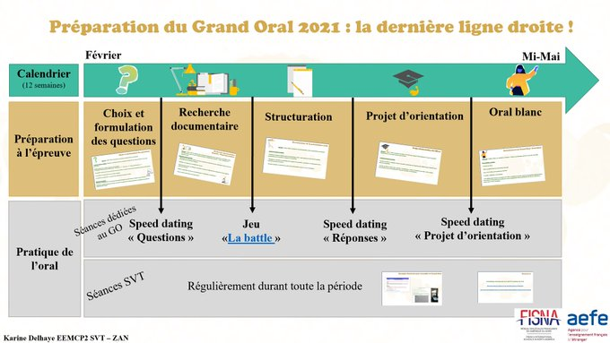

# Terminale-Spe-Maths

Documents pour ma classe de Terminale Spécialité Mathématiques

## Outils

* Interpréteur Python en ligne : <https://python.infobrisson.fr/>
* Site [Python seconde](http://www.frederic-junier.org/PythonSeconde/Python_Seconde_Parc/accueil_python_2nde.html)
* Site [Python au lycée](https://www.python-lycee.com/)
* Doceval, exerciseur en ligne : <https://doctools.dgpad.net/>
* Pour préparer le grand oral, un enregistreur en ligne qui permet de télécharger ensuite l'enregistrement au format mp3 : <https://www.mon-oral.net/>  Attention : utilisez le navigateur Chrome ou Chromium.

 
## Questions flash / Automatismes

- QCM de révisions de première  sur les suites : <https://link.dgpad.net/EfSY>
- QCM de révisions de première  sur la dérivation : <https://link.dgpad.net/yFGz>
- QCM de révisions de première  sur l'exponentielle : <https://link.dgpad.net/NdD6>
- QCM de révisions de première  sur les probabilités: <https://link.dgpad.net/t2zx>
- QCM sur les règles opératoires de limites: <https://link.dgpad.net/3bGH>
- QCM sur les limites de suites usuelles et les règles opératoires de limites : <https://link.dgpad.net/nSEF>
- [Automatismes de terminale 2020/2021](Automatismes/2020-2021/TerminaleAutomatismes-2020-2021.pdf)

## Épreuves terminales 

Le sujet propose : 
* trois exercices communs (numérotés 1, 2, 3) portant sur le cœur du programme, notés sur un total de 15 points
* deux exercices au choix (A, B), notés chacun sur 5 points.  Le candidat doit traiter les trois exercices obligatoires et un des deux exercices au choix. Afin d’éclairer le candidat, le sujet indique, au début dechacun des exercices au choix,les principaux domaines abordés
* [Sujet zéro publié le 7/12/2020](https://eduscol.education.fr/media/3730/download) : Référence : <https://eduscol.education.fr/2221/bac-2021>
  * [Mon corrigé (inachevé)](Annales/Corrige-Sujet-Zero.pdf)
  * Corrigé de l'exercice 1 (QCM) sur la chaîne [Maths en tête](https://www.youtube.com/watch?v=P99-KKr1NV0&feature=youtu.be)
  * Corrigé de l'exercice 3 (Probabilités) sur la chaîne [Maths en tête](https://www.youtube.com/watch?v=xSD6Ks2YhyE&feature=youtu.be)
 

## Grand oral :

Mon [diaporama de présentation](GrandOral/Presentation-Grand-Oral.pdf) : rien d'original, j'ai compilé des extraits de la page Eduscol et du document de synthèse de l'inspection générale

### Sitographie :

* Un document à lire pour mieux comprendre la recherche en mathématiques : [Conférence de Daniel Perrin](GranOral/Daniel_Perrin.pdf) 
* Des documents avec une présentation de l'épreuve et des pistes de sujets :
   * la page Eduscol sur le grand oral <https://eduscol.education.fr/729/presentation-du-grand-oral>
   * [document de synthèse d'un IPR de l'académie de Versailles](https://euler.ac-versailles.fr/IMG/pdf/pistes-grand-oral-huet-version-sans_programme.pdf)
   * [encore un document de l'académie de Versailles](GrandOral/oral_maths_euler.pdf)
   * [document de l'inspection générale](GrandOral/grand_oral_inspection_générale.pdf)
* Le site [Images des mathématiques](http://images.math.cnrs.fr/), consulter en particulier la rubrique [Pour aller moins loin](http://images.math.cnrs.fr/-Ressources-pedagogiques-pour-aller-moins-loin-.html).
  * Croissances cumulées : <http://images.math.cnrs.fr/La-loi-de-la-croissance-cumulee.html> thèmes logarithmes, suites ....
  * A propos des différentes preuves du théorème de Pythagore : <http://images.math.cnrs.fr/Encore-une-preuve-du-theoreme-de-Pythagore.html>
  * Combinatoire : [Démarrage trompeur](https://images.math.cnrs.fr/+Demarrage-trompeur+)
  * Loi binomiale, planche de Galton : [La courbe en cloche... transparente](http://images.math.cnrs.fr/La-courbe-en-cloche-transparente.html)
  
* Le site Culture Maths  <https://culturemath.ens.fr/>
* Le portail [Eduscol des mathématiques](https://eduscol.education.fr/maths/)

* Le site du livre [Le Guide du Grand Oral](https://grand-oral.lerobert.com/9782321015383) de Sthéphane de Freitas, créateur de la méthode "Porter sa voix", fondateur du concours d'éloquence qui a donné lieu au film "A voix haute". Des ressources méthodologiques et par disciplines : exempel en mathématiques <https://grand-oral.lerobert.com/partage/a/2032389/chapitre-les-ressources-numeriques-pour-les-mathematiques>
* La plateforme de l'académie de Lyon dédiée à la [culture scientifique](http://culture-scientifique-technique.enseigne.ac-lyon.fr/spip/).
* Arts et mathématiques :
  * Une galerie en ligne : <http://gallery.bridgesmathart.org/exhibitions/2021-joint-mathematics-meetings>
  
* Une page consacrée à la préparation du Grand Oral sur un [site](https://sites.google.com/a/prefas.org/svt_am_nord/loral-en-classe-de-svt?authuser=0) partagé par des collègues de SVT des lycées français d'Amérique du Nord  :

### Bibliographie :

* Une liste d'ouvrages de vulgarisation ou de fiction traitant des mathématiques : <http://algorythmes.blogspot.com/2020/11/bibliomaths-cest-mon-litteramath.html>
* Thème : Mathématiques et anglais :
  * "Enigmes mathématiques de Lewis Carroll - 72 problèmes pour vos nuits blanches " d'Elizabeth Busser
  * "Once upon an algorithm" de Martin Erwing
  * "Computational Fairy Tales" de Jeremy Kubica
* Le __"Dictionnaire de (presque) tous les nombres entiers"__ de Daniel Lignon aux éditions Ellipses : les clefs sont les entiers naturels successifs (pas tous ...) et les valeurs leurs propriétés avec des focus. Par exemple pour 43, on a un article sur les _nombres Mc Nugget_ puisque 43 est le plus grand entier qui ne peut pas être obtenu comme  6, 9 et 20 (traditionnellement les nombres de beignets de poulet possibles chez Mc Donalds). Les  _nombres Mc Nugget_  sont liés au problème de Frobenius de décomposstion des entiers en somme d'entiers premiers entre eux fixés (le système de monnaie par exemple (6,9,20)). Voir cet article (en anglais) sur le problème de Frobenius <https://mathworld.wolfram.com/CoinProblem.html>. Pour un nombre quelconque d'entiers fixé est un problème NP-complet. Il existe une formule pour deux entiers, un algorithme polynomial mais pas de formule pour trois et rien de connu pour 4. Des problèmes similaires sont ceux du rendu optimal de monnaie => un bon moyen de parler d'algorithmique. A propos d'algorithme glouton, voir l'exercice "Cannelés bordelais" du sujet national des Olympiades académiques de Première 2017 <http://math.univ-lyon1.fr/~lass/sujetlyon17.pdf> . A propos des  _nombres Mc Nugget_   voir cette video de [Scientifcfiz](https://youtu.be/mJ9a_-LT_QA).

### Des videos en ligne 

* [Conférence de Gérard Berry sur la révolution informatique dans les sciences](https://www.college-de-france.fr/site/gerard-berry/course-2015-01-28-16h00.htm)
* Chaînes de videos en ligne :
  * Pour découvrir à travers une petite  approche historique (par des collégiens mais très bien)  : <https://www.youtube.com/channel/UCIUbSRKVVOpWl_xB3soLU1g>
  * Pour approfondir : la chaîne de Mickael Launay <https://www.youtube.com/user/Micmaths>
  * Une chaîne YouTube. Des vidéos de vulgarisation mathématique toujours illustrées par des animations fort bien faites par leur créateur Grant Sanderson, qui a étudié les maths à Stanford et qui, après avoir été ingénieur en data sciences, est revenu à ses premières amours avec la chaîne [3blue1Brown](https://www.3blue1brown.com/). 
On pourra pointer la vidéo sur la modélisation de la propagation du Coronavirus, très claire et à la portée des lycéens. 
  * La chaîne You Tube de Mickael Launay <https://www.youtube.com/c/Micmaths/> avec de nombreuses videos à destination des élèves de terminale.
  * La chaîne You Tube Maths en Tête comporte de nombreuses videos sur l'histoire des mathématiques <https://www.youtube.com/c/AlexandreMorgan/featured>
  * Le site VideoMaths du CNRS rassemble de nombreuses videos qui pourraient donner des idées de questions pour le grand oral : <http://video.math.cnrs.fr/> avec souvent des ouvertures sur d'autres disciplines :
    * Couplage Maths/Physique, modélisation de la propagation de la chaleur avec les carrés magiques de Dirichlet, principe du maximum et preuve d'unicité, questions que peut se pose un mathématicien, théorème de convergence monotone : _Existe-t-il une solution ? Est-elle unique ? Peut-on la construire ?_ :  [Video Audimaths](https://youtu.be/2oq1UDpqEGQ)
    * La format de papier A4 (suites, second degré) :[Video Audimaths](https://youtu.be/sgsJuqaiCCM)
    * Magnifiques logarithmes par Benoit Rittaud (logarithmes, tables de calcul, histoire, aire sous l'hyperbole ...) : [Video Audimaths](https://youtu.be/-NcKh-qvb_g)  => la démonstration que l'aire sous la courbe d'un arce d'hyperbole entre 1 et u x v vérifie la relation fondamentale du logarithme pourrait être réexploitée.

* [Conférence de Daniel Perrin](https://youtu.be/dBTF2M3M1Uk)  _Cryptographie et nombres premiers_ avec plein d'anecdotes historiques :
  * Les mathématiques sont utiles : tunnel de Samos, fonction exponentielle et datation, comment gagner à un jeu télévisé (jeu de Monty Hall)
  * Les mathématiques inutiles aujourd'hui le seront peut-être demain : nombres premiers et cryptographie, histoire des codes secrets (parmi les exemples : histoire de Marie Stuart, code secret dans la nouvelle _Le scarabée d'or_ d'Edgar Poe => on pourrait faire déchiffrer des messages aux examinateurs en leur donnant les lettres les plus fréquentes dans la langue du message, proposer un petit programme Python ...)
  
* [Conférence de Cédric Villani : "Tout est mathématiques"](https://youtu.be/rLFUnCUyPko):
  * De la recherche fondamentale aux applications inattendues : courbure de Riemmann à la théorie de la relativité et aux GPS, distribution statistique des zéros de fonction zeta de Riemman et niveaux d'énergie des atomes
  * Formule de Boltzmann, entropie $s= k log(w)$ apprivoiser le hasard (Galton, loi des erreurs de Laplace etc ...)
  
  
### Des idées :

* Sport : comment prédire le classement final d'un championnat de foot ?  <https://www.statsperform.com/resource/why-2021-could-be-the-year-of-change-in-european-football/>
* Modélisation d'une épidémie :
  * un [podcast](https://www.franceculture.fr/emissions/la-methode-scientifique/la-methode-scientifique-emission-du-mercredi-27-mai-2020)
  * Modélisation du modèle SIR avec Geogebra (Christian Mercat IREM de Lyon) <https://www.geogebra.org/m/ztf3fqce>
* Suites de Fibonacci :
  * modèle de croissance des plantes avec les L-systèmes de Lindenmaier (pour expliquer Finobacci dans les plantes)
* La Ficelle, journal sur l'histoire de Lyon,  met à l'honneur dans son numéro d'Octobre,  André Marie Ampère, "où comment états d’âme et génie se marient et font avancer la science". 
Journal téléchargeable gratuitement depuis le site <http://www.laficelle.com/>
* Fausse preuve : la somme des entiers vaudrait-elle -1/12 ? <http://images.math.cnrs.fr/La-somme-des-entiers.html>
* Mathématiques et jeux, exemple du 2048. Questions qu'on peut se poser : les tuiles sont toutes des puissances de 2 (preuve par récurrence) ? quelle est la configurationthéorique de fin de jeu ? valeur de la plus grande tuile au 2048 (somme des termes consécutifs d'une suite géométrique, décomposition d'un nombre en base 2) ? Le score maximal ? Probabilité d'atteindre la configuration théorique de fin de jeu ? Quelles stratégies ? Voir <https://www.science4all.org/article/2048-game/>
* Théorèmes isopérimétriques : quelle forme pour une pizza d'aire donnée si on aime la croûte ou si on ne l'aime pas ? <https://culturemath.ens.fr/thematiques/geometrie/les-theoremes-isoperimetriques>
* A propos de la récurrence :
  * [Feuille d'exercices intéressante du Club de Maths de Nancy](http://depmath-nancy.univ-lorraine.fr/club/docs/1718/170920recurrence.pdf)
  * [Une autre feuille du Club de Maths de Nancy sur le flocon de Von Koch](http://paestel.fr/sites/default/files/Mat_les_ressources/1%C3%A8re/Atelier%2C%20probl%C3%A8me/mlr-une_introduction_aux_fractales.pdf)
  * [La page du Club de Maths de Nancy avec tous leurs exercices](http://depmath-nancy.univ-lorraine.fr/club/documents.html)
* Sur le site [Images des mathématiques](http://images.math.cnrs.fr/), consulter en particulier la rubrique [Pour aller moins loin](http://images.math.cnrs.fr/-Ressources-pedagogiques-pour-aller-moins-loin-.html).
  * Croissances cumulées : <http://images.math.cnrs.fr/La-loi-de-la-croissance-cumulee.html> thèmes logarithmes, suites ....
  * A propos des différentes preuves du théorème de Pythagore : <http://images.math.cnrs.fr/Encore-une-preuve-du-theoreme-de-Pythagore.html>
  * Combinatoire : [Démarrage trompeur](https://images.math.cnrs.fr/+Demarrage-trompeur+)
  * Loi binomiale, planche de Galton : [La courbe en cloche... transparente](http://images.math.cnrs.fr/La-courbe-en-cloche-transparente.html)
* A propos des échelles de représentation : linéaire ou logarithmique (échelle de Richter ....), une ressource Geogebra de Christian Mercat <https://www.geogebra.org/m/vgyp3kkq>
* Voyage au cœur de la cryptographie, un article sur [Culture Maths](https://culturemath.ens.fr/thematiques/lycee/voyage-au-coeur-de-la-cryptographie)

